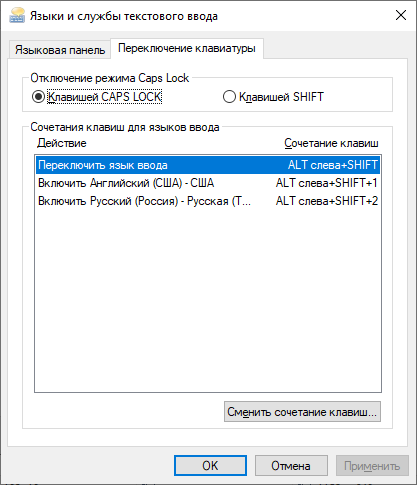

# SimpleSwitcher

Simple Switcher - программа для быстрого исправления раскладки набранного текста в Windows.
## Features

- Умеет работать в программах, запущенных от администратора. 
- Удерживая клавишу Shift, можно исправлять несколько слов подряд.
- Возможность использовать такие клавиши как Capslock, Scrolllock, RAlt, Ctrl, Shift, Shift+Shift, ... для любой функции программы.
- Не хранит набираемый текст в открытом виде (используется шифрование Windows).
- Позволяет произвольно переназначать любые клавиши (scancode remap)
- Показывает флаги стран в трее.
- Отключение accessibility функциональности Windows (например, отключения залипания после нажатия 5-ти Shift подряд).
- Смена регистра выделенного текста.

## Download & Install

Simple Switcher поставляется в portable виде (не требует установки).
Можно скачать последний опубликованный <a href="https://github.com/Aegel5/SimpleSwitcher/releases">релиз</a>, либо собрать из кода самостоятельно.

## Documentation

### Сборка из исходного кода:
- Установить требуемые программы: 
  - `Git for Windows`. Все настройки - по-умолчанию.
  - `Visual Studio 2022`. Необходим компонент C++. 
  - `CMake`. Нужно выбрать опцию "добавить в PATH".
  - `Python`. Можно выбрать опцию "добавить в PATH" для удобного запуска скриптов из командной строки.
- Скачать исходники.
  - Открыть командную строку (cmd.exe) и перейти в каталог, где будет храниться код программы.
  - Выполнить команду `git clone --recurse-submodules https://github.com/Aegel5/SimpleSwitcher.git`
- Внести патчи в библиотеку wxWidget
  - src\msw\taskbar.cpp: `m_iconAdded ? Operation_Modify : Operation_Add` заменить на `Operation_TryBoth`
- В созданной папке запустить скрипт `build.py`
- Собранная версия будет в папке `package_build/OUT`

### Использование CapsLock
_Рекомендуется:_ 
- Использовать клавишу CapsLock для исправления раскладки.
- Назначить комбинацию для активации режима CapsLock (по умолчанию Ctrl + CapsLock)

_Также возможно:_
- Сначала нужно переназначить CapsLock на клавишу F24 (вкладка Key Remap)
- Перезагрузить Windows
- Назначить клавишу F24 на требуемую функцию
- [Опционально] Назначить клавишу на срабатывание настоящего CapsLock (по умолчанию Ctrl + F24).
- Перед удалением программы, нужно снять галочку Remap CapsLock, чтобы вернуть исходное состояние.

### Альтернативный режим переключения (эмуляция Windows hotkeys)
Рекомендуется включать этот режим, так как он более стабилен. Для его настройки необходимо указать программе, какие хот-кеи используются в ОС (выделены голубым цветом в GUI).
По-умолчанию Alt+Shift - переключение яызка, Alt+Shift+1 - включить первый язык, ...

  
Пример назначения

   
 

### Отключение Ctrl + LAlt как RAlt на расширенных раскладках
Подробнее: https://github.com/Aegel5/SimpleSwitcher/issues/54
Для работы этой опции требуется включение альтернативного режима переключения

### Работа при удаленном подключении
#### RDP
При использовании rdp для подключения к удаленной ОС, все должно работать "из коробки". Можно установить SS как на локальный, так и на удаленный компьютер - будет отрабатывать только тот SS, в системе которого вы сейчас находитесь.
#### Другие клиенты
В случае других клиентов может быть проблема "double switch", когда срабатывают оба SS одновременно (локальный и удаленный).
Для исправления этой ситуации, в удаленном SS нужно поставить галочку "Allow remote keys", а в локальном добавить клиент программы подключения в исключения.

### Исключения для программ
Добавление в исключение в настоящий момент происходит через конфиг файл `SimpleSwitcher.json`

### Использование одиночных клавиш Ctrl,LCtrl,RCtrl,Shift,LShift,RShift,... в качестве хот-кея 
При использование клавиш-модификаторов как самостоятельный хот-кей, необходимо установить флаг #up для них. Иначе эти модификаторы будут недоступны в других приложениям.

## License

<a href="LICENSE">GPL-3.0 License</a>  

## Donate

Если вам нравится программа, и вы хотите поддержать ее развитие:
4276 1609 6336 6548, CберБанк, Александр Ж.

